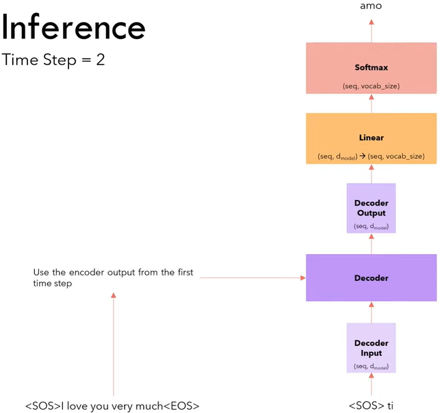
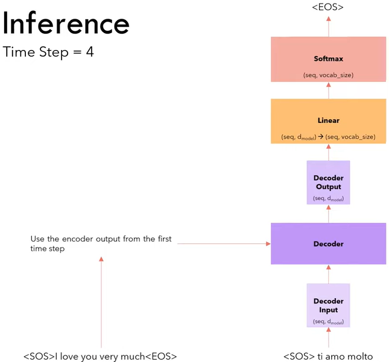
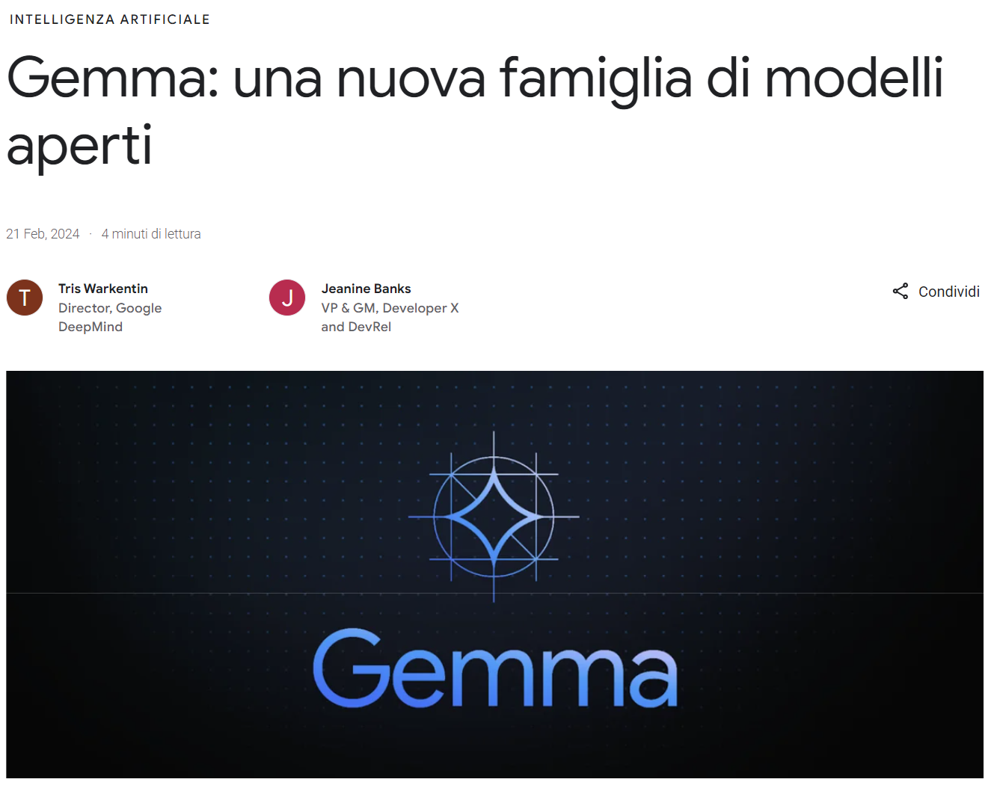

class: center, middle, bg_title, hide-count


```{r setup, include=FALSE}

options(
  tmltools.dir.version = FALSE,
  htmltools.preserve.raw = FALSE
)

knitr::opts_chunk$set(
  fig.retina = 3,
  warning = FALSE,
  message = FALSE,
  comment = "",
  out.width = "100%"
)
library(knitr)
library(xaringanExtra)
library(xaringanthemer)

library(tidyverse)
library(gridExtra)

library(countdown)
library(metathis)

library(here)

options(width = 59) # to fit into the right-column slides

```


```{r xaringans, echo=FALSE}
# https://github.com/gadenbuie/xaringanExtra
use_tachyons()
use_share_again()
use_panelset()
use_clipboard()
use_editable(expires = 1)
use_scribble()
use_freezeframe()
use_extra_styles(
  hover_code_line = TRUE,         #<<
  mute_unhighlighted_code = TRUE  #<<
)
use_progress_bar(color = "#0051BA", location = "top")
```

```{r style-share-again, echo=FALSE}
style_share_again(
  share_buttons = c("twitter", "linkedin", "pocket")
)
```


```{r meta, echo=FALSE}
meta() %>%
  meta_general(
    description = "GdL AI del DIMEILA - INAIL",
    generator = "xaringan and remark.js"
  ) %>% 
  meta_name("github-repo" = "CorradoLanera/occupational-ai-inail") %>% 
  meta_social(
    title = "AI Generative in Ambito Occupazionale: Fondamenti, Esmpi, Potenzialità e Perplessità",
    url = "https://CorradoLanera.github.io/occupational-ai-inail/#1",
    image = "https://github.com/CorradoLanera/occupational-ai-inail/raw/main/img/procione.jpeg",
    og_type = "website",
    og_author = "CL",
    twitter_card_type = "summary",
    twitter_creator = "@CorradoLanera"
  )
```


```{css, echo=FALSE}
.left-code {
  color: #777;
  width: 38%;
  height: 92%;
  float: left;
}
.right-code {
  color: #777;
  width: 55%;
  height: 92%;
  float: right;
  padding-top: 0.5em;
}
.left-plot {
  width: 43%;
  float: left;
}
.right-plot {
  width: 60%;
  float: right;
}
.hide-count .remark-slide-number {
  display: none;
}

.bg_title {
  position: relative;
  z-index: 1;
}

.bg_title::before {    
      content: "";
      background-image: url('img/bg1.png');
      background-size: contain;
      position: absolute;
      top: 0px;
      right: 0px;
      bottom: 0px;
      left: 0px;
      opacity: 0.1;
      z-index: -1;
}

```


```{r xaringan-themer, include=FALSE, warning=FALSE}
red <- "#f34213"
purple <- "#3e2f5b"
orange <- "#ff8811"
green <- "#136f63"
white <- "#FFFFFF"
pastel_orange <- "#F97B64"
blu_gray <- "#1F4257"
style_duo_accent(
    colors = c(
        red = red,
        purple = purple,
        orange = orange,
        green = green,
        white = white,
        pastel_orange = pastel_orange,
        blu_gray = blu_gray
    )
)
```


<br>

# **.orange[AI Generative] `r emo::ji("robot")`<br>in Ambito Occupazionale:**<br>**Fondamenti, Esmpi, Potenzialità e .orange[Perplessità]**

 

<br>

`r emo::ji("flowers")` **GdL AI del DIMEILA - INAIL** `r emo::ji("flowers")` - Roma & Teams, 2024/02/26 -


Corrado Lanera | [**.orange[Laboratorio di Intelligenza Artificiale per le Scienze Mediche]**](https://www.unipd-ubep.it/topics-laboratories/artificial-intelligence-for-medical-sciences-laims/)<br>[**Unità di Biostatistica, epidemiologia e Sanità Pubblica**](https://www.unipd-ubep.it/) | [**.red[University of Padova]**](https://unipd.it)<br>[.black[Dipartimento di Scienze Cardio- Toraco- Vascolari e Sanità Pubblica]](https://www.dctv.unipd.it/)

---
class: inverse, bottom, right, hide-count


```{r, echo=FALSE, out.width = "50%"}
knitr::include_graphics("img/profilo_CL.jpg")
```
# Per contattarmi...


[`r fontawesome::fa("link")`](https://www.unipd-ubep.it/) [**www.unipd-ubep.it**](https://www.unipd-ubep.it/)

[`r fontawesome::fa("mail-bulk")`](mailto:Corrado.Lanera@ubep.unipd.it) [**Corrado.Lanera**__.orange[@ubep.unipd.it]__](mailto:Corrado.Lanera@ubep.unipd.it)

[`r fontawesome::fa("github")`](https://github.com/corradolanera)
[`r fontawesome::fa("twitter")`](https://twitter.com/corradolanera)
[`r fontawesome::fa("telegram-plane")`](https://telegram.me/CorradoLanera)
**@CorradoLanera**

[`r fontawesome::fa("github")`](https://github.com/UBESP-DCTV)
**@UBESP-DCTV**


---
class: inverse, middle, center, hide-count

# .orange[Cos'è **Chat GPT**?]


.left[

- **Trasformatore** 

- **Preaddestrato**

- **Generativo**

- in **Chat**
]


---
class: inverse, middle, center, hide-count

# Chat GP.orange[T]: .orange[Trasformatore]

.pull-left[
#### Giugno 2017 (cambiò tutto!)

```{r, echo=FALSE, out.width="100%", fig.alt="https://arxiv.org/abs/1706.03762"}
knitr::include_graphics(
  here::here("img/attention-is-all-you-need.png")
)
```
]
.pull-right[
```{r, echo=FALSE, out.width="100%"}
knitr::include_graphics(
  here::here("img/full_transformer.png")
)
```
]


---
# .orange[Encoder]/.orange[decoder]

```{r, echo=FALSE, message=FALSE, warning=FALSE, fig.align="center", out.width="100%", fig.alt="https://jalammar.github.io/illustrated-transformer/"}
knitr::include_graphics("img/encdec.png")
```

---

# .orange[Trasformatori]

```{r, echo=FALSE, message=FALSE, warning=FALSE, fig.align="center", out.width="60%"}

```

---

# .orange[Trasformatori]

```{r, echo=FALSE, message=FALSE, warning=FALSE, fig.align="center", out.width="60%"}

```

---

# .orange[Trasformatori]

```{r, echo=FALSE, message=FALSE, warning=FALSE, fig.align="center", out.width="60%"}

```

---

# .orange[Trasformatori]

```{r, echo=FALSE, message=FALSE, warning=FALSE, fig.align="center", out.width="60%"}

```


---
class: inverse, middle, center, hide-count

# Chat G.orange[P]T: .orange[Preaddestrato]

```{r, echo=FALSE, out.width="90%", fig.alt="https://s10251.pcdn.co/pdf/2023-Alan-D-Thompson-AI-Bubbles-Rev-7b.pdf"}
knitr::include_graphics(
  here::here("img/2023-Alan-D-Thompson-AI-Bubbles-Rev-7b.png")
)
```


---
# .orange[Trasferimento] dell'apprendimento


```{r, echo=FALSE, out.width="80%", fig.alt="https://www.mdpi.com/1424-8220/23/2/570"}
knitr::include_graphics(
  here::here("img/transfer-learning.png")
)
```


---
# .orange[Zero-shot] learning


```{r, echo=FALSE, out.width="80%"}
knitr::include_graphics(
  here::here("img/transfer-vs-zero-shot.png")
)
```


---
class: inverse, middle, center, hide-count

# Chat .orange[G]PT: .orange[Generativo]

---
# Generatori: .orange[usi]


```{r, echo=FALSE, out.width="100%", fig.alt="https://txt.cohere.com/llm-use-cases/"}
knitr::include_graphics(
  here::here("img/LLM-use-cases.png")
)
```

---
class: inverse, middle, center, hide-count

# In .orange[chat]


---
# Prompt: .orange[ciclo]

```{r, echo=FALSE, out.width="100%", fig.alt="https://medium.com/@tariqsaad1997/chatgpt-prompt-engineering-part-4-building-a-customized-chatbot-165db7515c29"}
knitr::include_graphics(
  here::here("img/llm-prompt.png")
)
```


---
class: inverse, middle, center, hide-count

# .orange[Come usiamo **Chat GPT** / **Gemini**?]

.left[
- Base: **Web** 
- Avanzato: **API**
]


---
class: inverse, middle, center, hide-count

# Accesso .orange[Web]


.pull-left[.left[

https://chat.openai.com

```{r, echo=FALSE, out.width="95%"}

```

]]

.pull-right[.left[
https://gemini.google.com/app

```{r, echo=FALSE, out.width="95%"}

```
]]


---
# Parliamone... sul serio!

Richiesta info è divertente, infatti:
- .orange[sembra] intelligente...
- sbaglia .orange[di continuo]...
- ci aiuta a divulgare facilmente .orange[fake news]...

ma...
- **.orange[Traduci]** questo testo in spagnolo...
- **.orange[Riassumi]** questo articolo...
- **.orange[Proponi]** la traccia per un corso...
- **.orange[Rispondi]** a una mail...
- **.orange[Estrai]** i livelli di colesterolo dai risultati delle analisi...
- **.orange[Classifica]** le SDO in trauma/non-trauma...
- **.orange[Correggi]** un esame...
- **.orange[Abbozza]** un progetto...
- **.orange[Scrivi]** il codice R per fare questa analisi...

se _giochiamo_ seriamente fa comodo un po' più di **.orange[strategia]** `r emo::ji("wink")`...<br>
 .right[... e Molta **.orange[competenza]**!]

> Far svolgere compiti di cui non abbiamo competenze abbastanza elevate da capire se (**.orange[quando!!]**) **.orange[sbaglia]**... è **.orange[estremamente rischioso]**!!


---
class: inverse, middle, center, hide-count

# Accesso .orange[API]

---
# <small>Application Programming Interface</small>

### .orange[Request]

```{r, echo=FALSE, out.width="100%", fig.alt="https://platform.openai.com/docs/guides/gpt/chat-completions-api"}
knitr::include_graphics(
  here::here("img/api-request.png")
)
```

https://platform.openai.com/docs/guides/gpt/chat-completions-api


---
```{r, echo=FALSE}

```


---
class: inverse, middle, center, hide-count

# Come impatta questa tecnologia?


---
```{r, echo=FALSE}

```

---
# Lancio 2022-11-30

<br>
```{r, echo=FALSE}

```


---
# Google rilancia: Gemini
```{r, echo=FALSE}  


```

---

```{r, echo=FALSE}  

```

<https://blog.google/intl/it-it/una-nuova-famiglia-di-modelli-aperti-denominata-gemma/>

---

```{r, echo=FALSE}  

```

<https://blog.google/intl/it-it/una-nuova-famiglia-di-modelli-aperti-denominata-gemma/>


---
# Ma di chosa stiamo parlando?!...

```{r, echo=FALSE}  


```

---
# Tutto funziona grazie a NVIDIA<br>che e quindi...

```{r, echo=FALSE}  
knitr::include_graphics("img/chat-with-rtx.png")
```


---
# E grazie a tutto questo..

```{r, echo=FALSE}  


```


---
class: inverse, middle, center, hide-count

# .orange[Riflessioni su **Chat GPT**]

.left[

- Chi lo offre/usa? **Vincoli**

- Cosa offre? **Problematiche** 

- Come lo offre/usa? **Trasparenza**

- Cosa insegna? **Educazione/Formazione**
]


---
class: inverse, middle, center, hide-count

# .orange[Vincoli]

.left[
- Dati di addestramento prodotti da poche fascie sociali / geografiche nel mondo

- Possibilità di utilizzo da poche fascie sociali / geografiche nel mondo
]

---

# .orange[Costi] addestramento .orange[a casa]

```{r, echo=FALSE, out.width="100%", fig.alt="https://sunyan.substack.com/p/the-economics-of-large-language-models"}
knitr::include_graphics(
  here::here("img/gpt3-v100.png")
)
```
```{r, echo=FALSE, out.width="100%", fig.alt="https://sunyan.substack.com/p/the-economics-of-large-language-models"}
knitr::include_graphics(
  here::here("img/gpt3-h100.png")
)
```


---

# Costi di utilizzo?

Open AI, da una stima indipendente: https://www.semianalysis.com/p/the-inference-cost-of-search-disruption


~ **.orange[700.000 $/giorno]**

L'implementazione dell'attuale ChatGPT in ogni ricerca effettuata da Google richiederebbe **512.820,51 server A100 HGX** con un totale di **4.102.568 GPU A100**. Il costo totale di questi server e del networking **supera i 100 miliardi di dollari di capitale speso, di cui Nvidia riceverebbe buona parte.


- disponibilità dei dati (chi li produce? chi li raccoglie?)

- un passo avanti alla legge (Quanto veloci le normative? Quanto "buone" con tale velocità?)

---
class: inverse, middle, center, hide-count

# .orange[Problematiche]


.left[
- allucinazioni

- sbagli "invisibili",  apparente sicurezza e correttezza

- mancanza di (reale) comprensione del mondo reale

- Normative di fatto inesistenti (oligarchia dei provide)
]


---
class: inverse, middle, center, hide-count

# .orange[Trasparenza]

.left[
- Protezione del copyright sui dati utilizzati

- Dichiarazione esplicita / obbligatoria di utilizzo sui contenuti prodotti
]

---
class: inverse, middle, center, hide-count

# .orange[Educazione] / .orange[Formazione]

.left[
- modelli i cui risultati non possono essere spiegati (seppur non generati da una intelligenza!)

- peggioramento delle competenze digitali

- peggioramento dei dadi di addestramento dei modelli stessi 

- amplificazione delle polarizzazioni

- deeper deepfakes
]

---
class: inverse, middle, center, hide-count

# .orange[Conclusioni `r emo::ji("target")`]

---
# Chat GPT...

- **.orange[Possiamo permetterci di ignorarlo?]**

- **.orange[Possiamo permetterci di non impararlo?]**

- **.orange[Possiamo permetterci di non insegnarlo?]**

ma di più...

- **.orange[Possiamo permetterci di non richiedere venga studiato, appreso e utilizzato a tutti i livelli sanitario, politico, scolastico?! (come una calcolatrice...)]**


---
# .orange[Guidance] for .orange[Generative AI] in .orange[education] and .orange[research]
```{r, echo=FALSE}
knitr::include_app("https://unesdoc.unesco.org/ark:/48223/pf0000386693")
```

> Per scaricare il PDF, [cicca qui](https://inee.org/sites/default/files/resources/386693eng.pdf)


---
## .orange[EdGPT]...

<!-- ```{r, echo=FALSE} -->
<!-- knitr::include_url( -->
<!--   "https://ednovation.com/edgpt/", height = "500px"  -->
<!-- ) -->
<!-- ``` -->


---
# .orange[Link Utili]

<small> 
<small> 
<small> 


Deep Learning:
- Trasformer:
  - (Attention is All You Need) https://arxiv.org/abs/1706.03762
  - (video) https://youtu.be/zxQyTK8quyY
  - (testo) https://jalammar.github.io/illustrated-transformer/
  - (zero-shot) https://amitness.com/2020/05/zero-shot-text-classification/

GPT:
- Chat GPT: https://chat.openai.com
- API: https://openai.com/product
- Tokenizer (GUI): https://platform.openai.com/tokenizer
- Tiktoken (BPE): https://github.com/openai/tiktoken
- Playground: https://platform.openai.com/playground
- EdGPT: https://ednovation.com/edgpt/

Corso Prompt Engeneering:
- (gratis) https://www.deeplearning.ai/short-courses/chatgpt-prompt-engineering-for-developers/

Report UNESCO:
- (sito) https://unesdoc.unesco.org/ark:/48223/pf0000386693
- (PDF) https://inee.org/sites/default/files/resources/386693eng.pdf


---
class: inverse, center, middle, hide-count
name: mylastslide

.bg-washed-green.b--dark-green.ba.bw2.br3.shadow-5.ph4.mt5[
.left[
_**.orange[Quando ormai si vola] / .orange[Non si può cadere più]**_
]

.tr[
— Vasco Rossi<br>1995/07/12 **Gli angeli**<br>https://youtu.be/Qi2wDkUIFGk
]
]


## Grazie per la .orange[vostra] attenzione `r emo::ji("kissing_heart")`

Slides: https://bit.ly/occupational-ai-inail


[`r fontawesome::fa("link")`](https://www.unipd-ubep.it/) [**www.unipd-ubep.it**](https://www.unipd-ubep.it/) | 
[`r fontawesome::fa("mail-bulk")`](mailto:Corrado.Lanera@ubep.unipd.it) [**Corrado.Lanera@ubep.unipd.it**](mailto:Corrado.Lanera@ubep.unipd.it)

[`r fontawesome::fa("github")`](https://github.com/corradolanera)
[`r fontawesome::fa("twitter")`](https://twitter.com/corradolanera)
[`r fontawesome::fa("telegram-plane")`](https://telegram.me/CorradoLanera)
**@CorradoLanera** | 
[`r fontawesome::fa("github")`](https://github.com/UBESP-DCTV)
**@UBESP-DCTV**

<br>
<br>
